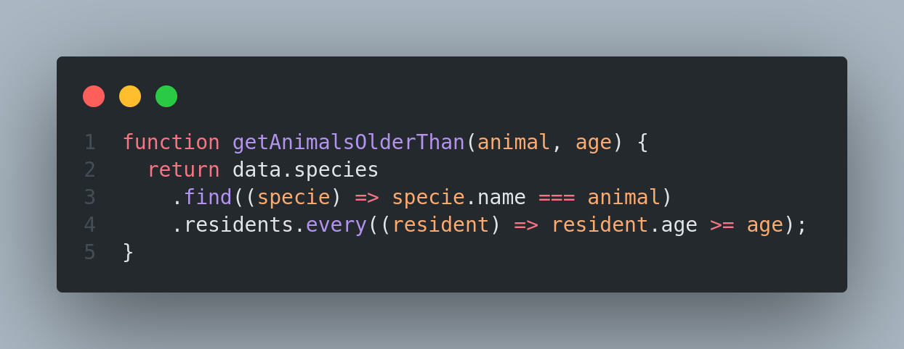
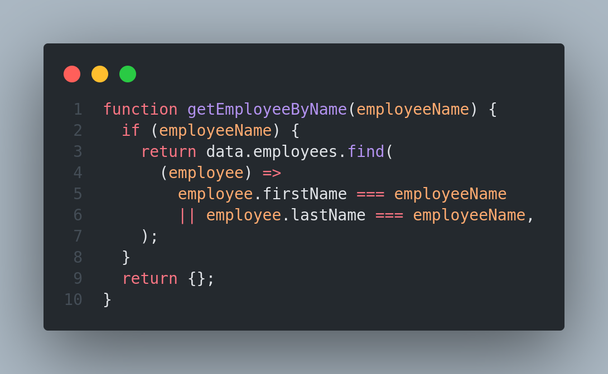
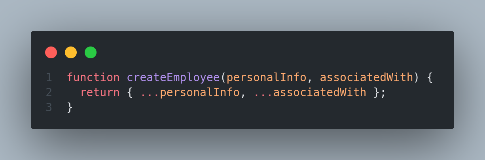
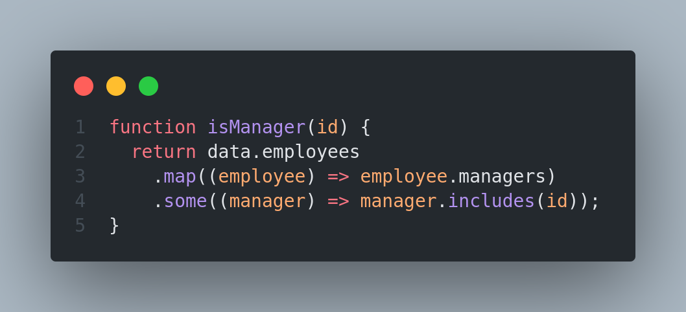
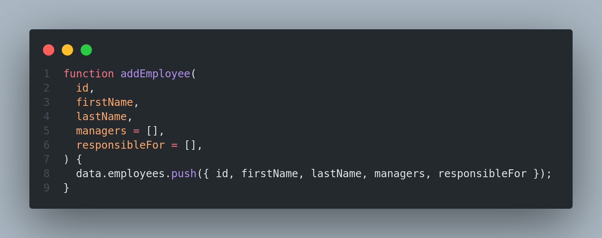
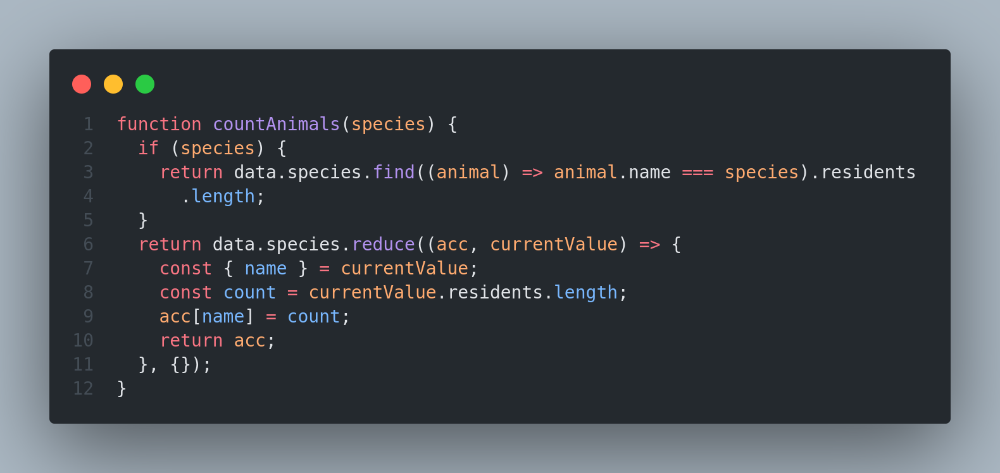
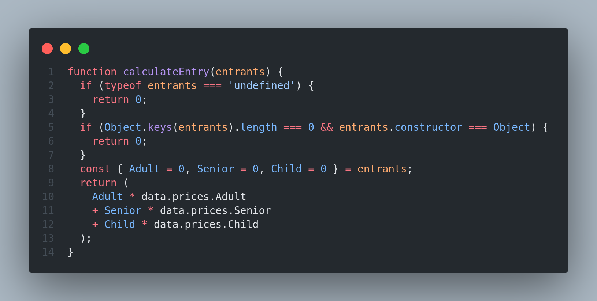
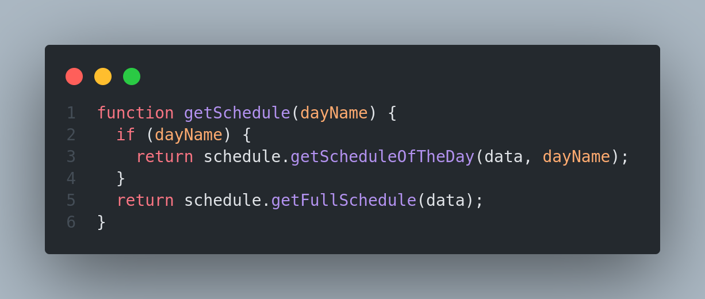
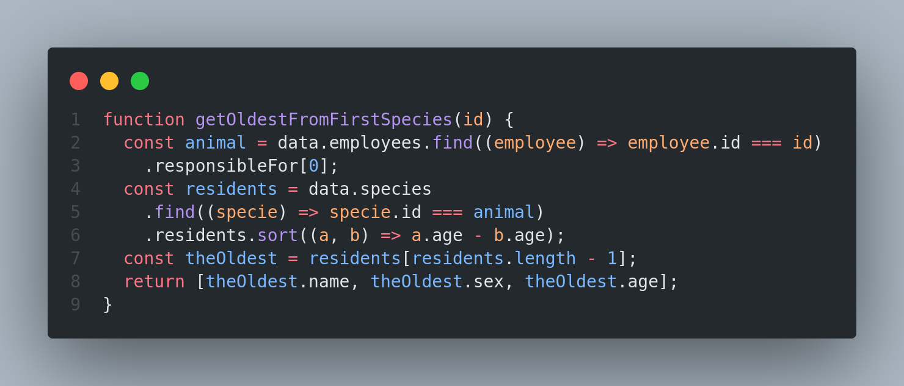
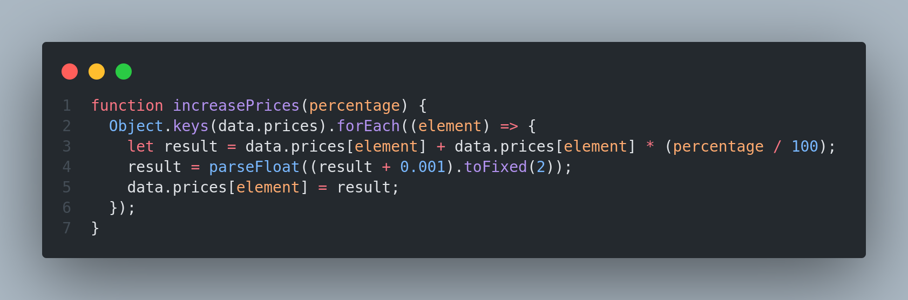

# Trybe Project Zoo Functions 04/08/2021
 

  

 

## Habilidades

- Produzir código legível, conciso e expressivo utilizando as novas funcionalidades do ES6;
- Utilizar as Higher Order Functions para manipular e criar arrays;
- Escolher a Higher Order Function mais adequada para a obtenção de um resultado esperado;
- Aprender a usar de forma conjunta as Higher Order Functions;
- Interpretar testes unitários e produzir soluções que atendam a eles.

## Desenvolvimento
Funções para atender aos requisitos propostos e garantir que todas as funções passem nos testes unitários.

 

  
  
  
  
  
  
  
  
  
  
  

## Resultados

- `2` dia de projeto;
- `13` requisitos;
- Percentual de cumprimento de requisitos obrigatórios `84.62%`;
- Percentual de cumprimento de requisitos totais `84.62%`.

